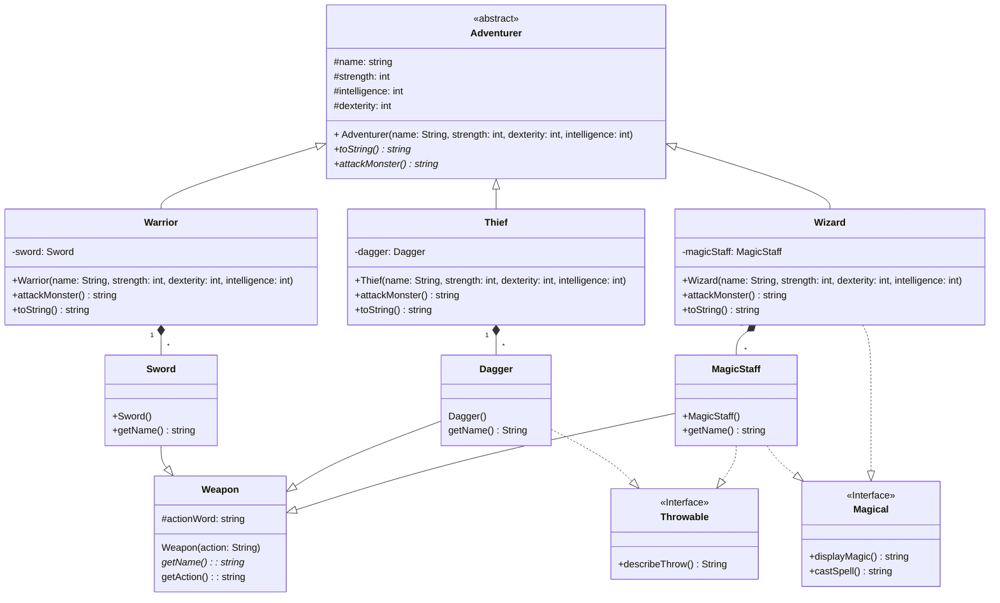

```mermaid
classDiagram
    Adventurer <|-- Warrior
    Adventurer <|-- Thief
    Adventurer <|-- Wizard
    Warrior "1" *-- "*" Sword
    Thief "1" *-- "*" Dagger
    Wizard "1" *-- "*" MagicStaff
    Sword --|> Weapon
    Dagger --|> Weapon
    MagicStaff --|> Weapon
    Dagger ..|> Throwable
    MagicStaff ..|> Throwable
    MagicStaff ..|> Magical
    Wizard ..|> Magical

    class Adventurer {
        <<abstract>>
        #name: string
        #strength: int
        #intelligence: int
        #dexterity: int
        + Adventurer(name: String, strength: int, dexterity: int, intelligence: int)
        +toString() string*
        +attackMonster() string*
    }
    class Weapon {
        #actionWord: string
        Weapon(action: String)
        getName(): string*
        getAction(): string
    }
    
    class Thief {
        -dagger: Dagger
        +Thief(name: String, strength: int, dexterity: int, intelligence: int)
        +attackMonster()string
        +toString()string
    }
    class Warrior {
        -sword: Sword
        +Warrior(name: String, strength: int, dexterity: int, intelligence: int)
        +attackMonster()string
        +toString()string
    }
    class Wizard{
        -magicStaff: MagicStaff
        +Wizard(name: String, strength: int, dexterity: int, intelligence: int)
        +attackMonster()string
        +toString()string
    }
    class Dagger {
        Dagger()
        getName() String
    }
    class MagicStaff {
        +MagicStaff()
        +getName() string
    }
    class Sword {
        +Sword()
        +getName() string
    }
    class Magical {
        <<Interface>>
        +displayMagic() string
        +castSpell() string
    }
    class Throwable {
        <<Interface>>
        +describeThrow() String
    }


```