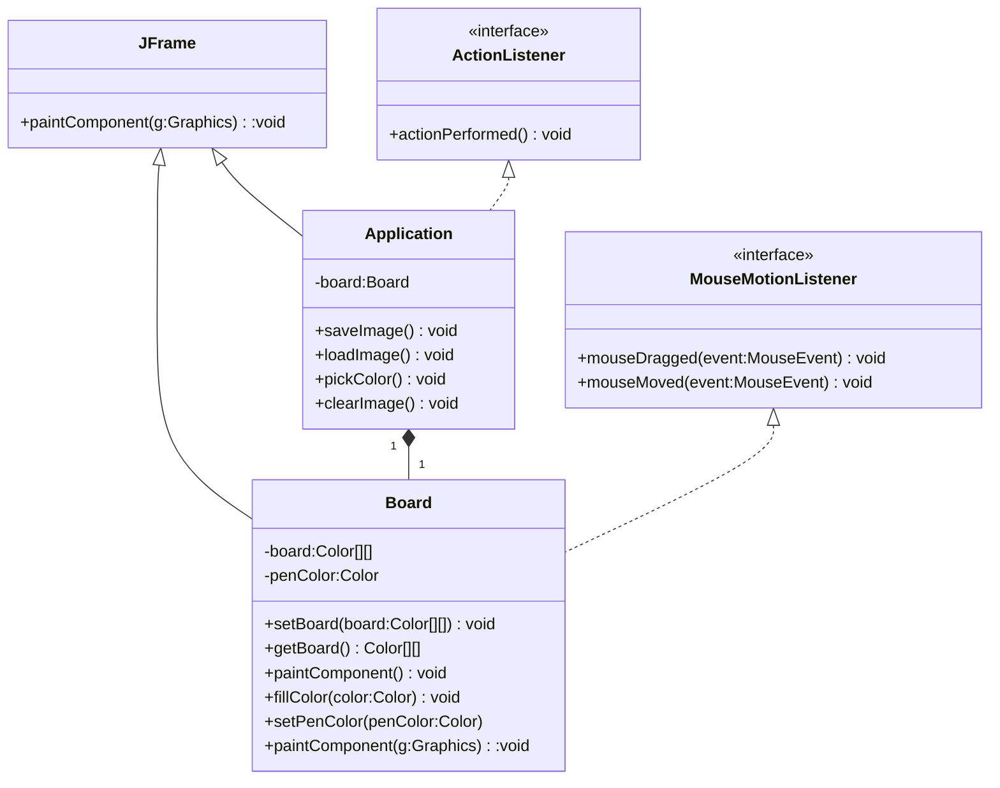

```mermaid
classDiagram
    
class Application{
    -board:Board
    +saveImage()void
    +loadImage()void
    +pickColor()void
    +clearImage()void
}
class Board{
    -board:Color[][]
    -penColor:Color
    +setBoard(board:Color[][])void
    +getBoard()Color[][]
    +paintComponent()void
    +fillColor(color:Color)void
    +setPenColor(penColor:Color)

    +paintComponent(g:Graphics):void
}
class ActionListener{
    <<interface>>
    +actionPerformed()void
}
class MouseMotionListener{
    <<interface>>
    +mouseDragged(event:MouseEvent)void
    +mouseMoved(event:MouseEvent)void
}
    JFrame <|-- Application
    JFrame <|-- Board
    Application "1" *-- "1" Board
    ActionListener <|.. Application
    MouseMotionListener <|..Board
    
class JFrame{
    +paintComponent(g:Graphics):void
}
```