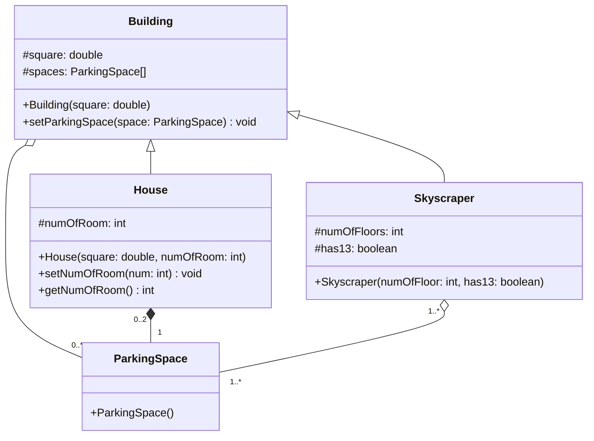

```mermaid
classDiagram
    Building <|-- House
    Building <|-- Skyscraper
    Building "0..*" o-- "0..*" ParkingSpace
    House "0..2" *-- "1" ParkingSpace
    Skyscraper "1..*" o-- "1..*" ParkingSpace
    
    class Building {
        #square: double
        #spaces: ParkingSpace[]
        +Building(square: double)
        +setParkingSpace(space: ParkingSpace) void
    }
    class House {
        #numOfRoom: int
        +House(square: double, numOfRoom: int)
        +setNumOfRoom(num: int) void
        +getNumOfRoom() int
    }
    class Skyscraper {
        #numOfFloors: int
        #has13: boolean
        +Skyscraper(numOfFloor: int, has13: boolean)
    }
    class ParkingSpace {
        +ParkingSpace()
    }
```