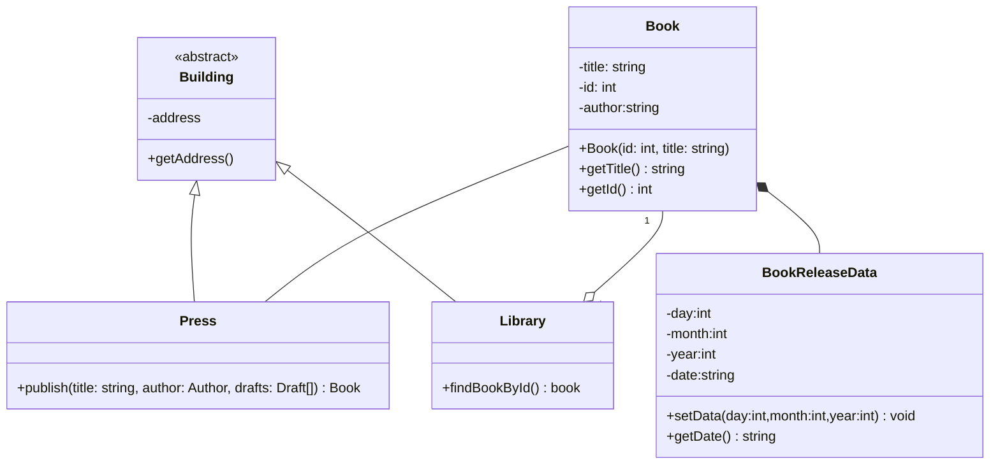

```mermaid
classDiagram
    class Building{
        <<abstract>>
        -address
        +getAddress() 
    }
    class Library{
        +findBookById() book
    }
    class Book {
        -title: string
        -id: int
        -author:string
        +Book(id: int, title: string)
        +getTitle() string
        +getId() int
    }
    class BookReleaseData{
        -day:int
        -month:int
        -year:int
        -date:string
        +setData(day:int,month:int,year:int) void
        +getDate() string
    }
    class Press {
        +publish(title: string, author: Author, drafts: Draft[]) Book
    }
    

    Building <|-- Press
    Building <|-- Library
    Book "1"--o "*" Library
    Book *-- BookReleaseData
    Book -- Press
    
```