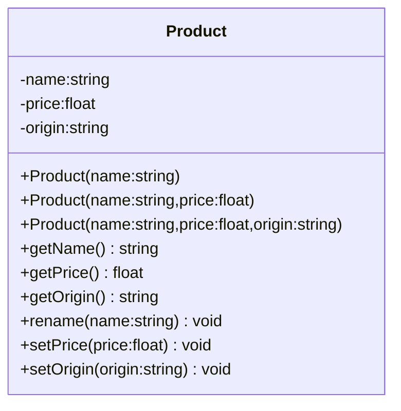

```mermaid
classDiagram
class Product{
        -name:string
        -price:float
        -origin:string
        +Product(name:string)
        +Product(name:string,price:float)
        +Product(name:string,price:float,origin:string)
        +getName() string
        +getPrice() float
        +getOrigin() string
        +rename(name:string) void
        +setPrice(price:float) void
        +setOrigin(origin:string) void
}
```