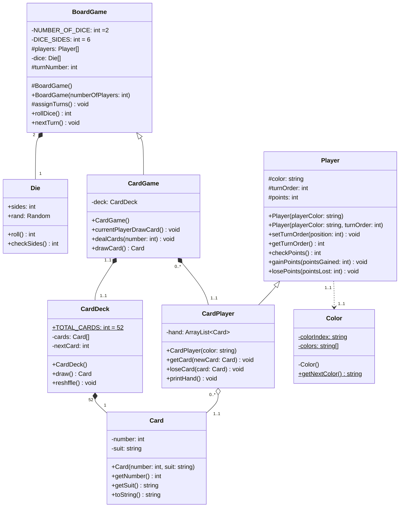

The reason I used `Composition` instant of `Aggregation` here was because the lifecycle stages of `BoardGame` in the code shows the classes, `Die`, `CardDeck`, `Card`, and `CradPlayer`, are built in the constructors.
Which means they will "die" when lifecycle of `BoardGame` died.

I used aggregation to describe `Card` and `CardPlayer` because the Card, that the Player has, comes from the function `getCard(Card)` , which is if lifecycle of `CardPlayer` died, the `Card` is still “being alive”.

