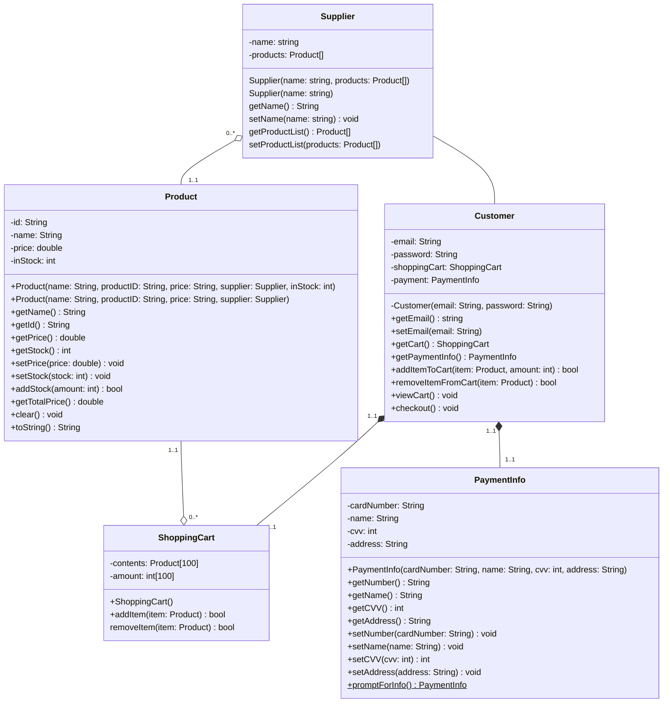

```mermaid
classDiagram
    Supplier -- Customer
    Supplier "0..*" o-- "1..1" Product
    Product "1..1" --o "0..*" ShoppingCart
    Customer "1..1" *-- "1..1" ShoppingCart
    Customer "1..1 "*-- "1..1" PaymentInfo 
    class Product {
        -id: String
        -name: String
        -price: double
        -inStock: int
        +Product(name: String, productID: String, price: String, supplier: Supplier, inStock: int)
        +Product(name: String, productID: String, price: String, supplier: Supplier)
        +getName() String
        +getId() String
        +getPrice() double
        +getStock() int
        +setPrice(price: double) void
        +setStock(stock: int) void
        +addStock(amount: int) bool
        +getTotalPrice() double
        +clear() void
        +toString() String
    }
    class ShoppingCart {
        -contents: Product[100]
        -amount: int[100]
        +ShoppingCart()
        +addItem(item: Product) bool
        removeItem(item: Product) bool
    }
    class PaymentInfo {
        -cardNumber: String
        -name: String
        -cvv: int
        -address: String
        +PaymentInfo(cardNumber: String, name: String, cvv: int, address: String)
        +getNumber() String
        +getName() String
        +getCVV() int
        +getAddress() String
        +setNumber(cardNumber: String) void
        +setName(name: String) void
        +setCVV(cvv: int) int
        +setAddress(address: String) void
        +promptForInfo() PaymentInfo$
    }
    class Customer {
        -email: String
        -password: String
        -shoppingCart: ShoppingCart
        -payment: PaymentInfo
        -Customer(email: String, password: String)
        +getEmail() string
        +setEmail(email: String)
        +getCart() ShoppingCart
        +getPaymentInfo() PaymentInfo
        +addItemToCart(item: Product, amount: int) bool
        +removeItemFromCart(item: Product) bool
        +viewCart() void
        +checkout() void
    }
    class Supplier {
        -name: string
        -products: Product[]
        Supplier(name: string, products: Product[])
        Supplier(name: string)
        getName() String
        setName(name: string) void
        getProductList() Product[]
        setProductList(products: Product[])
    }

```