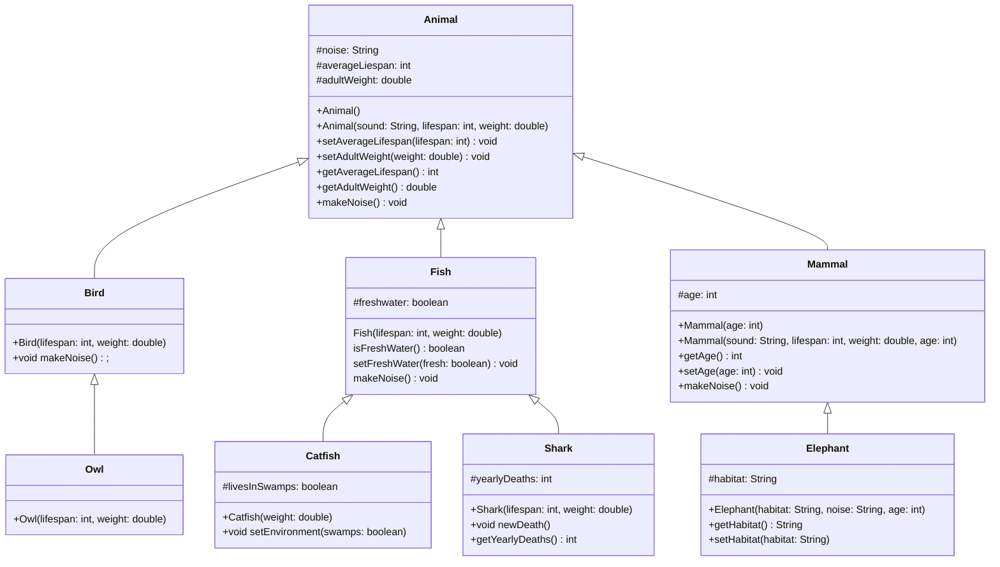

```mermaid
classDiagram
    class Animal {
        #noise: String
        #averageLiespan: int
        #adultWeight: double
        +Animal()
        +Animal(sound: String, lifespan: int, weight: double)
        +setAverageLifespan(lifespan: int) void
        +setAdultWeight(weight: double) void
        +getAverageLifespan() int
        +getAdultWeight() double
        +makeNoise() void
    }
    class Bird {
        +Bird(lifespan: int, weight: double)
        +void makeNoise();
    }
    class Owl {
        +Owl(lifespan: int, weight: double)
    }
    class Fish {
        #freshwater: boolean
        Fish(lifespan: int, weight: double)
        isFreshWater() boolean
        setFreshWater(fresh: boolean) void
        makeNoise() void
    }
    class Catfish {
        #livesInSwamps: boolean
        +Catfish(weight: double)
        +void setEnvironment(swamps: boolean)
    }
    class Shark {
        #yearlyDeaths: int
        +Shark(lifespan: int, weight: double)
        +void newDeath()
        +getYearlyDeaths() int
    }
    class Mammal {
        #age: int
        +Mammal(age: int)
        +Mammal(sound: String, lifespan: int, weight: double, age: int)
        +getAge() int
        +setAge(age: int) void
        +makeNoise() void
    }
    class Elephant {
        #habitat: String
        +Elephant(habitat: String, noise: String, age: int)
        +getHabitat() String
        +setHabitat(habitat: String)
    }
    Animal <|-- Bird
    Animal <|-- Fish
    Animal <|-- Mammal
    Fish <|-- Catfish
    Fish <|-- Shark
    Mammal  <|-- Elephant
    Bird  <|-- Owl
```